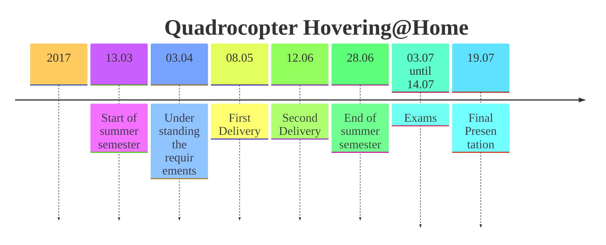

# README

## Timeline

## **Submodules**

Disclaimer: Software has been written by students of various batches under supervision of Prof. Friedrich and Lecturer M Sc. Vikas Agrawal and open-sourced for further public development

The project is a combination of following domains

<table data-view="cards"><thead><tr><th align="center"></th><th data-type="content-ref"></th><th data-hidden data-card-cover data-type="image">Cover image</th></tr></thead><tbody><tr><td align="center">Realtime Kernel</td><td><a href="readme-kernel.md">readme-kernel.md</a></td><td><a href="https://images.unsplash.com/photo-1629654291663-b91ad427698f?crop=entropy&#x26;cs=srgb&#x26;fm=jpg&#x26;ixid=M3wxOTcwMjR8MHwxfHNlYXJjaHw1fHxMaW51eHxlbnwwfHx8fDE3NjUwMTk5ODB8MA&#x26;ixlib=rb-4.1.0&#x26;q=85">https://images.unsplash.com/photo-1629654291663-b91ad427698f?crop=entropy&#x26;cs=srgb&#x26;fm=jpg&#x26;ixid=M3wxOTcwMjR8MHwxfHNlYXJjaHw1fHxMaW51eHxlbnwwfHx8fDE3NjUwMTk5ODB8MA&#x26;ixlib=rb-4.1.0&#x26;q=85</a></td></tr><tr><td align="center">Embedded</td><td><a href="/broken/pages/GgcPwNPeVIz3j6k7nzeh">Broken link</a></td><td><a href="https://images.unsplash.com/photo-1610812387871-806d3db9f5aa?crop=entropy&#x26;cs=srgb&#x26;fm=jpg&#x26;ixid=M3wxOTcwMjR8MHwxfHNlYXJjaHwxfHxSYXNwYmVycnklMjBQSXxlbnwwfHx8fDE3NjUwMTk5NzF8MA&#x26;ixlib=rb-4.1.0&#x26;q=85">https://images.unsplash.com/photo-1610812387871-806d3db9f5aa?crop=entropy&#x26;cs=srgb&#x26;fm=jpg&#x26;ixid=M3wxOTcwMjR8MHwxfHNlYXJjaHwxfHxSYXNwYmVycnklMjBQSXxlbnwwfHx8fDE3NjUwMTk5NzF8MA&#x26;ixlib=rb-4.1.0&#x26;q=85</a></td></tr><tr><td align="center">Matlab Control Simulation</td><td><a href="readme-simulation.md">readme-simulation.md</a></td><td><a href="https://images.unsplash.com/photo-1580642135909-a59e2b8805c6?crop=entropy&#x26;cs=srgb&#x26;fm=jpg&#x26;ixid=M3wxOTcwMjR8MHwxfHNlYXJjaHw2fHxGbGlnaHQlMjBjb250cm9sfGVufDB8fHx8MTc2NTAyMDA2MXww&#x26;ixlib=rb-4.1.0&#x26;q=85">https://images.unsplash.com/photo-1580642135909-a59e2b8805c6?crop=entropy&#x26;cs=srgb&#x26;fm=jpg&#x26;ixid=M3wxOTcwMjR8MHwxfHNlYXJjaHw2fHxGbGlnaHQlMjBjb250cm9sfGVufDB8fHx8MTc2NTAyMDA2MXww&#x26;ixlib=rb-4.1.0&#x26;q=85</a></td></tr><tr><td align="center">Android Application</td><td><a href="readme-android.md">readme-android.md</a></td><td><a href="https://images.unsplash.com/photo-1607252650355-f7fd0460ccdb?crop=entropy&#x26;cs=srgb&#x26;fm=jpg&#x26;ixid=M3wxOTcwMjR8MHwxfHNlYXJjaHwxfHxhbmRyb2lkfGVufDB8fHx8MTc2NTAyMDEzNHww&#x26;ixlib=rb-4.1.0&#x26;q=85">https://images.unsplash.com/photo-1607252650355-f7fd0460ccdb?crop=entropy&#x26;cs=srgb&#x26;fm=jpg&#x26;ixid=M3wxOTcwMjR8MHwxfHNlYXJjaHwxfHxhbmRyb2lkfGVufDB8fHx8MTc2NTAyMDEzNHww&#x26;ixlib=rb-4.1.0&#x26;q=85</a></td></tr><tr><td align="center">Virtual Reality</td><td><a href="readme-virtual-reality.md">readme-virtual-reality.md</a></td><td><a href="https://images.unsplash.com/photo-1593508512255-86ab42a8e620?crop=entropy&#x26;cs=srgb&#x26;fm=jpg&#x26;ixid=M3wxOTcwMjR8MHwxfHNlYXJjaHwzfHxWaXJ0dWFsJTIwUmVhbGl0eXxlbnwwfHx8fDE3NjUwMjAxNTN8MA&#x26;ixlib=rb-4.1.0&#x26;q=85">https://images.unsplash.com/photo-1593508512255-86ab42a8e620?crop=entropy&#x26;cs=srgb&#x26;fm=jpg&#x26;ixid=M3wxOTcwMjR8MHwxfHNlYXJjaHwzfHxWaXJ0dWFsJTIwUmVhbGl0eXxlbnwwfHx8fDE3NjUwMjAxNTN8MA&#x26;ixlib=rb-4.1.0&#x26;q=85</a></td></tr><tr><td align="center">Website</td><td><a href="readme-web-development.md">readme-web-development.md</a></td><td><a href="https://images.unsplash.com/photo-1573867639040-6dd25fa5f597?crop=entropy&#x26;cs=srgb&#x26;fm=jpg&#x26;ixid=M3wxOTcwMjR8MHwxfHNlYXJjaHw4fHx3ZWJzaXRlfGVufDB8fHx8MTc2NTAyNzkyNHww&#x26;ixlib=rb-4.1.0&#x26;q=85">https://images.unsplash.com/photo-1573867639040-6dd25fa5f597?crop=entropy&#x26;cs=srgb&#x26;fm=jpg&#x26;ixid=M3wxOTcwMjR8MHwxfHNlYXJjaHw4fHx3ZWJzaXRlfGVufDB8fHx8MTc2NTAyNzkyNHww&#x26;ixlib=rb-4.1.0&#x26;q=85</a></td></tr><tr><td align="center">Database</td><td><a href="readme-database.md">readme-database.md</a></td><td><a href="https://images.unsplash.com/photo-1529078155058-5d716f45d604?crop=entropy&#x26;cs=srgb&#x26;fm=jpg&#x26;ixid=M3wxOTcwMjR8MHwxfHNlYXJjaHw2fHxEYXRhJTIwY29sbGVjdGlvbnxlbnwwfHx8fDE3NjUwMjc5NTJ8MA&#x26;ixlib=rb-4.1.0&#x26;q=85">https://images.unsplash.com/photo-1529078155058-5d716f45d604?crop=entropy&#x26;cs=srgb&#x26;fm=jpg&#x26;ixid=M3wxOTcwMjR8MHwxfHNlYXJjaHw2fHxEYXRhJTIwY29sbGVjdGlvbnxlbnwwfHx8fDE3NjUwMjc5NTJ8MA&#x26;ixlib=rb-4.1.0&#x26;q=85</a></td></tr><tr><td align="center">Visualization</td><td><a href="readme-visualization.md">readme-visualization.md</a></td><td><a href="https://images.unsplash.com/photo-1535016120720-40c646be5580?crop=entropy&#x26;cs=srgb&#x26;fm=jpg&#x26;ixid=M3wxOTcwMjR8MHwxfHNlYXJjaHwxfHx2aXN1YWx8ZW58MHx8fHwxNzY1MDYwOTA2fDA&#x26;ixlib=rb-4.1.0&#x26;q=85">https://images.unsplash.com/photo-1535016120720-40c646be5580?crop=entropy&#x26;cs=srgb&#x26;fm=jpg&#x26;ixid=M3wxOTcwMjR8MHwxfHNlYXJjaHwxfHx2aXN1YWx8ZW58MHx8fHwxNzY1MDYwOTA2fDA&#x26;ixlib=rb-4.1.0&#x26;q=85</a></td></tr></tbody></table>

## Topic and Teams



<figure><figcaption></figcaption></figure>



<figure><figcaption></figcaption></figure>



#### Team Tasks Technical

<figure><figcaption></figcaption></figure>

#### Team Tasks Managing

<figure><figcaption></figcaption></figure>

## Interfaces

This section outlines the key interfaces between the control application and two major system components: the embedded software and the virtual reality environment. These interfaces are essential for validating and operating the quadcopter system in both simulated and real-world conditions.

* Interface between Control Application and Embedded Software
* Interface between Control Application and Virtual Reality

**Interfaces Between Control Application and System Components**

Even with the availability of the Raspberry Pi and control simulations, the physical quadcopter body (or complete vehicle) may not be accessible for testing. While this is not a limitation in our current setup, Tier II suppliers often face delays in receiving the actual hardware. Therefore, we assume the quadcopter body is currently unavailable.

To validate the embedded software without the physical plant (in this case, the quadcopter), we employ **Hardware-in-the-Loop (HiL) testing**. This method ensures that the communication between the embedded environment and the control application is functioning correctly.

**Interface Between Control Application and Virtual Reality**

The MATLAB-based **Hovering@Home** model is actively running and integrates with the Virtual Reality system. In this setup, the quadcopter's position is controlled by head movements captured by the VR team. The target hovering position is always at coordinates (0, 0, 0) with an altitude of 1 meter.

Any external disturbance—such as a physical push or wind—should trigger the quadcopter to autonomously return to its default position. To ensure this behavior, the VR team must develop a **verification software**. One of its key use cases involves altering the quadcopter’s (x, y, z) position and validating whether the system correctly recalculates and restores it to (0, 0, 0). These positional changes should be **visually represented in a 3D environment** for effective analysis.
